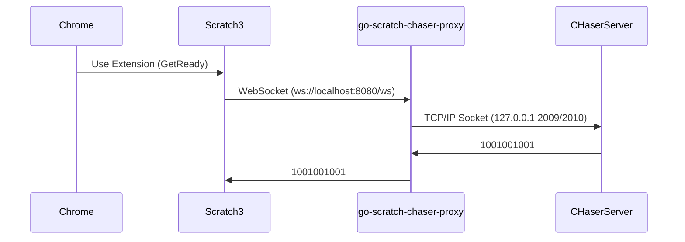

# これはなに？
Scratch3とCHaserサーバーを仲介するプロキシープログラムです。

Scratch3（ブラウザ）は仕様上、直接CHaserサーバーとTCP/IPのSocket通信を行うことはできません。そのためこのプログラムがクライアントとサーバーのやりとりを仲介します。



# 使い方

```
go mod tidy
go build
./chrome-chaser-proxy
```
