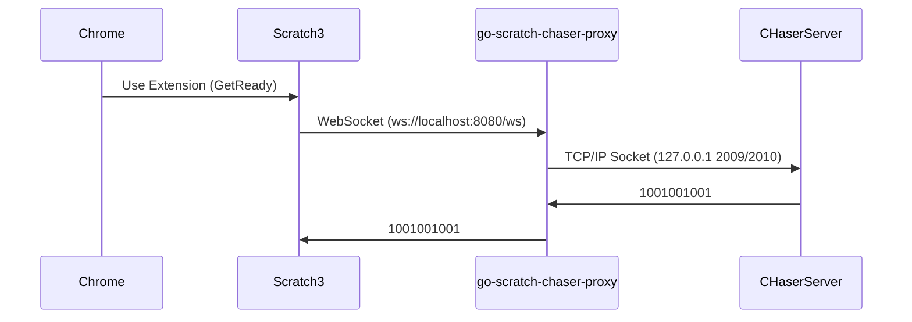

# これはなに？
Scratch3とCHaserサーバーを仲介するプロキシープログラムです。

Scratch3（ブラウザ）は仕様上、直接CHaserサーバーとTCP/IPのSocket通信を行うことはできません。そのためこのプログラムがクライアントとサーバーのやりとりを仲介します。



# あそび方

## 前提状況
- CHaserサーバーを実行してゲームができる環境をあらかじめ用意してください。
- インターネット環境が必要です。
- Scratch3の利用には対応したブラウザーが必要です（Chromeの最新版を推奨）
- パソコンは1台でもできますし、4つの役割をそれぞれ異なるパソコンにすることもできます。
    - CHaserサーバー
    - Coolクライアント (Scratch3を操作するブラウザ)
    - Hotクライアント
    - scratch-chaser-proxy を実行するパソコン

## 実行手順
### scratch-chaser-proxy
1. [リリースページ](https://github.com/ueki-kazuki/go-scratch-chaser-proxy/releases)からお使いのOSに対応したプログラムをダウンロードします。
2. コマンドプロンプトまたはターミナルからダウンロードしたファイルを実行します。

### CHaserサーバー
1. CHaserサーバーを起動し「TCP接続待ち状態」にします。


### Coolクライアント (Scratch3)
1. ブラウザで https://ueki-kazuki.github.io/scratch-gui/ を開きます。
2. 拡張機能から "CHaser" を追加します。
3. ブロックから "127.0.0.1 に Cool で ユーザー1 という名前で接続する" をスクリプトエリアにドラッグアンドドロップします。
4. 必要に応じて接続先CHaserサーバーのIPアドレスを変更してください。
5. ブロックを実行します。
6. CHaserサーバーのCoolの状態が「準備完了」になれば接続成功です。
7. 繰り返しなどいろいろなブロックを組み合わせて動かしてみましょう！

## ゲームをやり直すときは
- ゲームのたびに scratch-chaser-proxy を実行し直す必要はありません。
- 再度ゲームをしたい場合は、CHaserサーバーを起動して「TCP接続待ち状態」にしたら、Scratchを再度再生するだけでOKです。


# ビルド方法

```
go mod tidy
make
./bin/scratch-chaser-proxy
```
